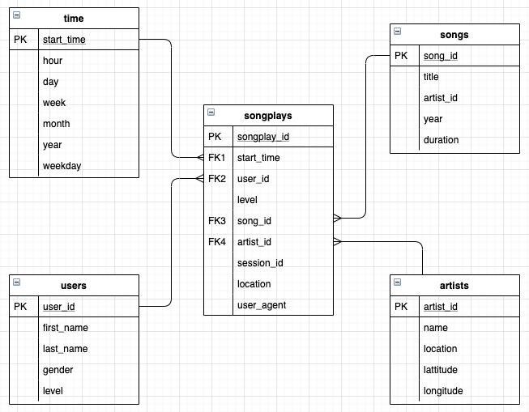

 ## Project: Data Lake & Spark

This is the third project for the Data Engineering Nanodegree, in which we put in practice concepts like:
- Data warehouse
- PySpark
- Data Lake
- AWS

### Introduction

A music streaming startup, Sparkify, has grown their user base and song database even more and want to move their data warehouse to a data lake. Their data resides in S3, in a directory of JSON logs on user activity on the app, as well as a directory with JSON metadata on the songs in their app.

As their data engineer, you are tasked with building an ETL pipeline that extracts their data from S3, processes them using Spark, and loads the data back into S3 as a set of dimensional tables. This will allow their analytics team to continue finding insights in what songs their users are listening to.

You'll be able to test your database and ETL pipeline by running queries given to you by the analytics team from Sparkify and compare your results with their expected results.

### Project Description

 In this project, you'll apply what you've learned on Spark and data lakes to build an ETL pipeline for a data lake hosted on S3. To complete the project, you will need to load data from S3, process the data into analytics tables using Spark, and load them back into S3. You'll deploy this Spark process on a cluster using AWS.

### Project Files

**etl.py**

Script that get the song & log data from an S3 bucket, transform the data according the database schema and then load the info back to s3  in a parquet format.

**dl.cfg**

AWS keys

### Database Schema
In order to response to the business needs we're using a star schema, that gives to us the advantage to use simply queries and joins and do fast aggregations... way to do analytics!

The schema is compose by 4 dimentional tables and one fact table.

#### Fact Table
**songplays** - records in log data associated with song plays i.e. records with page NextSong
- songplay_id, start_time, user_id, level, song_id, artist_id, session_id, location, user_agent

#### Dimension Tables

**users** - users in the app
- user_id, first_name, last_name, gender, level

**songs** - songs in music database
- song_id, title, artist_id, year, duration

**artists** - artists in music database
- artist_id, name, location, latitude, longitude

**time** - timestamps of records in **songplays** broken down into specific units
- start_time, hour, day, week, month, year, weekday

In addition, there are two more tables **(staging)** that we used to store the data from S3 buckets.
- STAGING_EVENTS
- STAGING_SONGS
